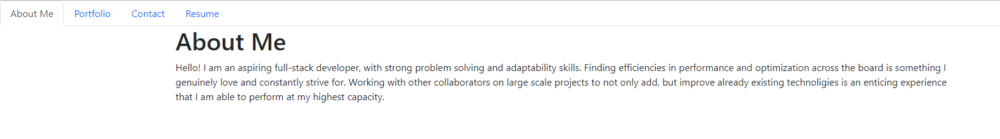
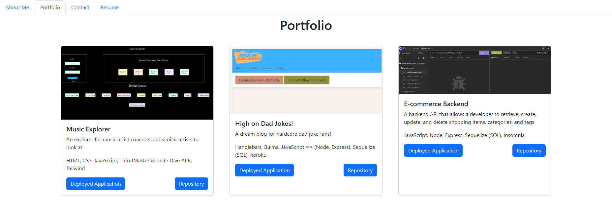
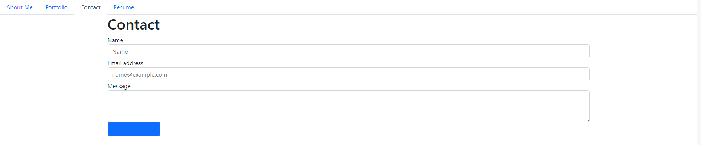
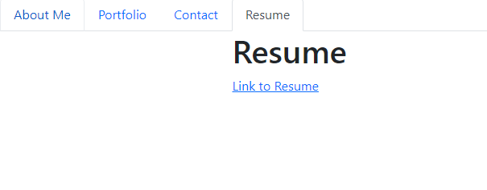

# React Portfolio

  ## Description
  
  A fully client-side, single-page application built with React. Includes an About Me, Portfolio, Resume, and Contact form (coming soon)! 
  
  ## Table of Contents 
    
  - [Installation](#installation)
  - [Usage](#usage)
  - [Credits](#credits)
  - [License](#license)
  - [Credits](#credits)
  - [Tests](#tests)
  - [Questions](#questions)
  
  ## Installation
  
  Visit the application link provided below:
  - https://marquiswillis.github.io/react-portfolio   

   
  ## Usage
  
  Navigate through the tabs like a normal website

  
  
  
  
  
  
  

  
  ## License
  
  none
  
  ## Tests
  
  none

  ## Questions

  GitHub: https://github.com/MarquisWillis

  Email: mailto:marquiswillis99@gmail.com

  By using the mailto above and (eventually) use the contact form provided in the application

  